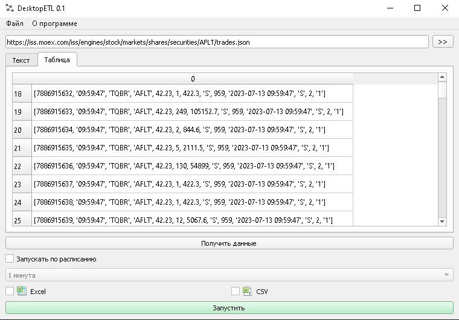

<h1 align="center">DesktopETL - простое ETL приложение для конвертирования файлов формата XML/JSON в формат XLS/CSV</h1>
<h3 align="center"></h3>

<h1>Установка и запуск</h1>

<ol>
<li> Склонируйте данный репозиторий </li>
<li> В папке проекта: <code> pip install -r requirements.txt </code></li>
<li> В папке проекта: <code>python main.py</code> </li>
</ol>

<h1>Лицензия</h1>
Данный проект распространяется в рамках лицензии Apache